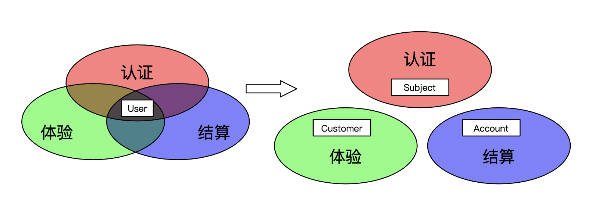

> 本文基于多模块系统讨论，不适用于单模块系统。

特定的模型只需要关注特定的业务问题，因此应该呆在模块内。但是现实中，有时模型会穿越边界进入另一个模块，并带来问题。

假设我们在开发一个网上商店，首先，为了实现身份认证，我们创建了User类，用于认证身份，其API形如：

``` java
public class UserController {
    public User authenticate(String username, String password);
}
```
此时，直接返回User已经埋下了问题，我们继续看。

为了让用户能够买东西，我们需要向User（调用身份认证API获得）添加了充值和结算功能。

为了提高购买体验，我们再次向User添加一些统计功能。

接下来，我们发现模型都是通用的依赖，将其放入一个公共模块，称为模型模块给业务模块直接使用。

随着开发，更多的功能被加到User，每次都需要修改认证服务（User是认证服务提供的），这很不方便，于是改为各个模块直接访问数据库，并继续添加功能直到出现下面的问题。


## 问题

__问题1 修改Schema困难__

当我们需要删除或者修改User的功能时，我们发现必须先更新所有依赖模块后才能更新，否则未更新的模块无法存取相应的表。然而，由于模型是一个公共模块，我们需要查看每个业务模块后，才能确定修改计划。

__问题2 安全隐患__

每个依赖User的模块都能看到User全部数据。这可能出现安全漏洞，比如，某个模块把User的密码打印到日志里。为此，向模型添加敏感信息时，需要检查所有依赖模块的代码，防止泄漏。

__问题3 事故放大__

模型一般都需要持久化，这些数据存储在一起的，可能造成事故的放大。比如，一个模块异常删除了User数据，那么所有使用User的功能受到到影响。

__问题4 意外修改__ 

修改模型时，如果不注意本模块是否拥有相关部分，很可能会破坏其他模块。并且，有时候这种修改是基于条件触发的，使得这种问题较难排查。然后，即使本模块拥有修改的部分，也不能保证没有其他模块依赖。
因此，修改模型时，需要先分析修改范围是否属于本模块，之后再查看所有模块是否依赖现有实现。

由于以上问题，我们对模型开始只加不删，轻易不动已有功能...

## 分析

究其原因，我们发现根源在于认证API返回了User。这使得模型穿越边界变成可能（依赖认证模块并直接使用User）。之后，公共模块的做法降低了穿越的难度（依赖该公共模块）。最后，共享数据库彻底卸下了边界，使得模型能够被任意模块存取。

三步操作后，模型成了各个模块的共享内核，任何对内核的改动都会变得困难。并且这种共享内核，如果由多个团队维护，很可能变成没人维护任其发展。

## 解决



理想的解决方案是恢复模型的边界。每个模块应当有专门的关注点，其模型亦如此。

首先，可以逐步将User拆分到各自的模块中。过程中如果发现拆不开的，有两种办法，如果是模块划分问题，可以调整模块划分。如果不是，则需要选择一个模块拥有该模型，在另一个模块的模型中通过引用该模型ID或内联（复制）所需的部分。

拆分完成后，检查提供API的地方，确保模型没有出现在请求响应中，如果有则需要更新API。

最后，消费外部API时，确保外部模型没有直接进入，如果有则先将其翻译成本地模型。这一步是一种防御机制，用来防御外部API变化造成破坏。


