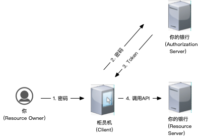
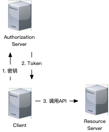
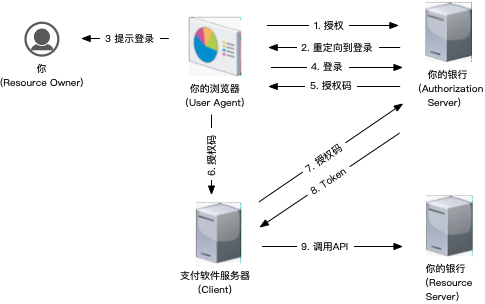

> OAuth 2.0是一种认证授权工业标准，为多种应用（Web、桌面程序、手机、智能设备等）提供简单易安全的认证授权方法。
> https://oauth.net/2/

安全问题，离不开信任关系：

举个例子，我们都知道银行卡的密码可以在柜员机输入。这是因为我们信任柜员机。

再举个例子，你去便利店买东西，用手机支付时，都会提示你输入密码。因为支付服务信任的是你，而不是你的手机。

我们从角色和授权流程两个方面入手，来看看OAuth 2.0。

### 角色

1. Resource Owner

    `Resource Owner`是指资源的属主，一般是最终用户，有时候也可以是一台机器。比如你把钱存进银行，钱就是`Resource`，而你就是`Resource Owner`。

2. Resource Server

    `Resource Server`是指资源的托管者，其需要保证资源的安全性。你的银行就是`Resource Server`。

3. Client

    `Client`指需要使用资源的应用，比如你的支付软件就是`Client`。
    
4. Authorization Server

    `Authorization Server`指负责认证`Resource Owner`身份和授权的实体。比如，你的银行就是`Authorization Server`。

OAuth 2.0的[角色](https://tools.ietf.org/html/rfc6749#section-1.1)划分明确了`Resource Owner`与`Client`的角色分离，有助于清晰定义信任关系。

角色之间的信任关系，取决于使用的[授权流程](https://tools.ietf.org/html/rfc6749#section-4)。

### 授权流程

1. `Resource Owner Password Credentials Grant`

    

    我们称这个授权流程为密码授权。

    ⚠️ 这个流程中，密码直接交给Client，有可能被泄漏，（[密码泄漏](https://tools.ietf.org/html/rfc6819#section-4.4.3)。
    因此，需要注意采用安全的传输方式，不使用明文传输密码，打印日志时进行脱敏等措施。
    
    密码授权仅适用于不能使用其他授权的时候（比如不支持重定向）。

2. `Client Credentials Grant`

    

    为了与密码区分，我们称其为机要授权流程。其中的`Client Credentials`是在服务提供商处购买服务时，由服务提供商提供的。
    一般是指`Client Id`与`Client Secret`。
    
    `Client Credentials`是机密信息需要安全保存，因此该流程一般常见于服务器使用。此时，服务器既是`Resource Owner`又是`Client`。

    ⚠️ 其安全问题与密码认证类似。由于服务器是在受控的环境运行，相比密码授权安全一些，但也需要注意，比如**不要**将机密信息明文的写到配置文件中，可以采用环境变量或加密等方式。如果万一泄漏了，应当立即重置。另外，有工具可以帮助检查泄漏，比如：

    - [gittyleaks](https://github.com/kootenpv/gittyleaks)
    - [Github Secret Scanning](https://help.github.com/en/github/administering-a-repository/about-secret-scanning)

3. `Authorization Code Grant`

    

    我们称其为授权码授权流程。这个流程没有直接把密码交给`Client`，因此避免密码暴露给第三方Client。
    
    ⚠️ 由于code是通过url传递的,会在referrer头或其他方式被泄漏。[RFC 6819](https://tools.ietf.org/html/rfc6819#section-4.4.1)。

    [OAuth安全实践草案16](https://tools.ietf.org/html/draft-ietf-oauth-security-topics-16#section-4.2.4) 给出了一些反制措施：
    - Client通过"Referrer-Policy: no-referrer"抑制Referrer头
    - Authorization Server通过[PKCE](https://tools.ietf.org/html/rfc7636)验证Client，验证通过才发布`Access Token`
    - Authorization Server限制授权码只能兑换一次，重复兑换时撤销相关已发布的`Access Token`
    - 用返回[自动提交表单](https://openid.net/specs/oauth-v2-form-post-response-mode-1_0.html)

4. `Implicit Grant`

    

    由于在授权过程中没有验证`Client`，我们称其为隐式授权。隐式授权本意是为了减少Client与Authorization Server的交互次数，但由于其安全问题没有好的对策，已经被认为是**禁止**使用的。应当使用授权码授权。

    ⚠️ 隐式授权会造成Access Token泄漏，并且由于`Authentication Server`没有验证`Client`，无法限制`Access Token`应用范围([Sender-Constrained Access Tokens](https://tools.ietf.org/html/draft-ietf-oauth-security-topics-16#section-4.9.1.1.2))。所以，隐式授权是**禁止**使用的。

    
另外，为了支持交互受限设备，后续又增加了一个[Device Authorization Grant](https://tools.ietf.org/html/rfc8628)，本文就不介绍了。

## 总结

总结一下，OAuth 2.0 这4种授权流程在信任关系方面采取的手段：

|信任关系|密码授权|机要授权|授权码授权|隐式授权|
|------|---|---|---|---|
|`RO`信任`C`|  用户    | 管理员   | 用户    |   用户   |
|`C`信任`AS`| `https` | `https` | `https` | `https` |
|`AS`信任`C`| `Client Credentials`|`Client Credentials`|`Client Credentials`+`PKCE`+检查重定向地址| N/A |
|`C`信任`RS`| `https` | `https` | `https`+`state` | `https`+`state` |
|`RS`信任`C`| `Access Token`|`Access Token`|`Access Token`| N/A |

- RO = Resource Owner
- C = Client
- AS = Authorization Server
- RS = Resource Server

安全问题是一场持续进行的竞赛，没有一劳永逸的方案。并且，人的安全意识也非常重要，技术和机器无法解决全部问题。

附上笑话一枚：

图片来自：https://xkcd.com/327/
